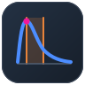
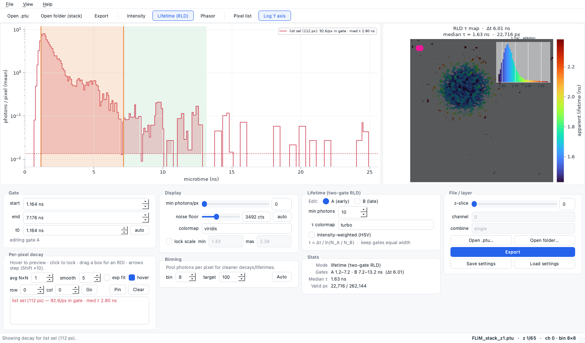
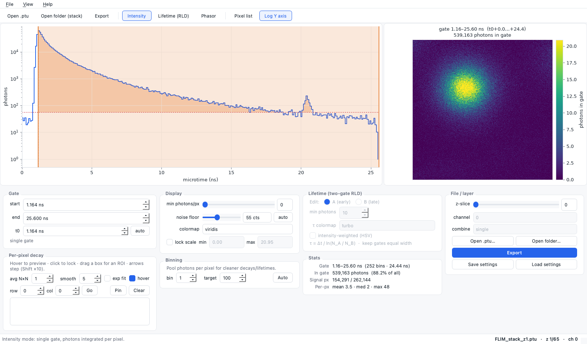
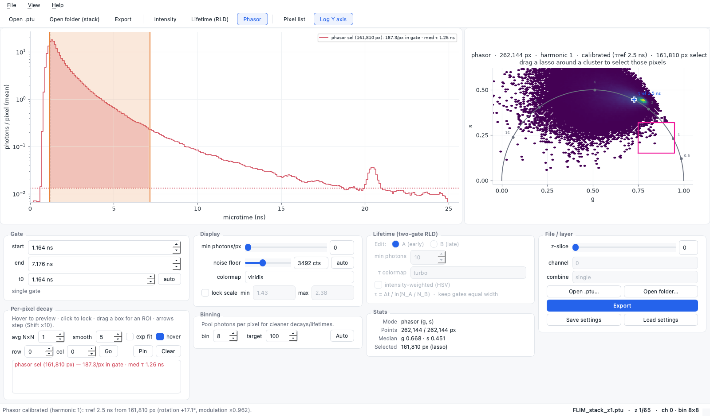
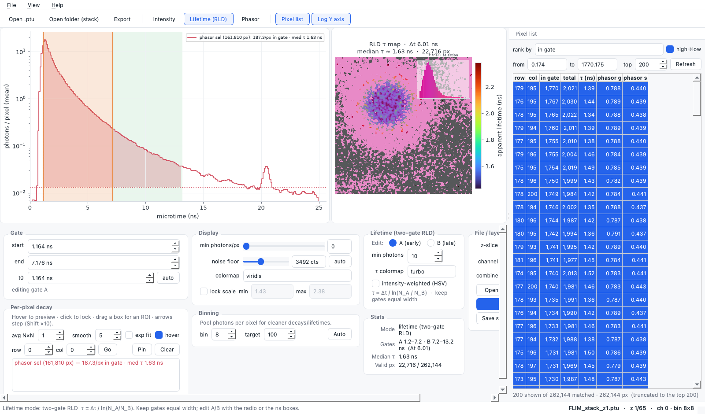
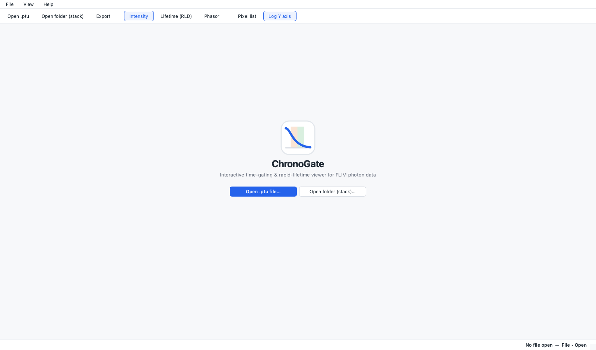

<div align="center">



# ChronoGate

### Interactive time-gating & lifetime viewer for FLIM photon data.

ChronoGate loads a PicoQuant `.ptu` photon stream, reconstructs the per-pixel
fluorescence decay, and lets you drag a time gate across it while the gated
image, apparent-lifetime map, and phasor plot update live. Built for anyone who
wants fit-free lifetime *contrast* from raw TCSPC data without leaving a desktop app.

[](https://www.python.org/)
[](https://doc.qt.io/qtforpython/)
[](https://numpy.org/)
[](https://matplotlib.org/)
[](#getting-started)
[](LICENSE)

<br />



</div>

---

## Overview

Fluorescence-lifetime imaging (FLIM) records, for every detected photon, *when*
it arrived relative to the laser pulse. The histogram of those arrival times, per
pixel, is the fluorescence decay — and where a photon lands in time tells you
about the molecular state that emitted it. **Time gating** keeps only the photons
in a chosen time window and sums them per pixel, giving lifetime *contrast* with
no curve fitting at all.

ChronoGate is that gate, made interactive: drag it across the decay and watch the
image change, switch to a two-gate lifetime map or a phasor plot, lasso a
population, and export a reproducible figure with its raw numbers attached. It
stays deliberately fit-free and numpy-only — the fast, honest front half of a
FLIM workflow, with a clean hand-off to Fiji/ImageJ for the rest.

## Features

- **Live time gating** — drag or type a gate on the decay; the gated image
  redraws in real time via a precomputed **prefix sum**, so every update is O(pixels),
  independent of gate width.
- **Two-gate rapid lifetime (RLD)** — a fit-free per-pixel apparent-lifetime map,
  **τ = Δt / ln(N_A / N_B)**, from an early and a late gate. Background is removed
  per gate; dim, non-decaying pixels are masked for an honest map.
- **Phasor analysis with calibration** — every pixel as a point in the **(g, s)**
  plane on the universal semicircle, **reference-lifetime calibration** against a
  known dye (rotation + modulation), a **second harmonic**, and a τ ruler on the plot.
- **Lasso & pixel selections** — draw around a phasor cluster or multi-select in
  the **pixel list**; the selection is pooled into one decay, spotlighted on the
  image, and carried through every export. **Undo** (Ctrl+Z) protects a selection
  from a stray click.
- **Honest imaging** — a dim-pixel **intensity threshold** and an auto-set
  **noise floor** (robust baseline, subtracted per gate), plus **spatial binning**
  with an **Auto** suggestion sized from the photon statistics.
- **Reproducible export** — raw-value **TIFF**, colormapped **PNG**, decay/selection
  **CSVs**, per-selection **aggregate statistics**, and a **provenance JSON** that
  doubles as a loadable settings file. A dialog chooses exactly which artefacts,
  which folder, single plane or the whole **z-stack** (batch), and can **restrict
  everything to the selection**.
- **One-page report** — a publication-style **PNG + PDF** summary: the headline
  number with its uncertainty, the decay diagnostic, the primary plot, and the
  field — with a **sha256** of the source file in the provenance.
- **Open in Fiji** — hand the raw raster straight to **[Fiji](https://fiji.sc/)/ImageJ**,
  reconstructing the ChronoGate display range, LUT, and selection ROI via a generated macro.

## Screenshots

<table>
  <tr>
    <td width="50%">
      <br />
      <sub><b>Time gating</b> — drag the gate on the decay; the gated intensity image redraws live.</sub>
    </td>
    <td width="50%">
      <br />
      <sub><b>Phasor</b> — every pixel in (g, s), a lasso selection, and reference-lifetime calibration.</sub>
    </td>
  </tr>
  <tr>
    <td width="50%">
      <br />
      <sub><b>Pixel list</b> — rank pixels by any metric; multi-select pools them into one selection.</sub>
    </td>
    <td width="50%">
      <br />
      <sub><b>Welcome</b> — open a single <code>.ptu</code> or a whole numbered z-stack folder.</sub>
    </td>
  </tr>
</table>

> Screenshots use the bundled example FLIM stack (a real PicoQuant `.ptu` z-series), not fabricated data.

## Tech stack

| Layer            | Technology                                                                 |
|------------------|----------------------------------------------------------------------------|
| Language         | [Python](https://www.python.org/) 3.9+                                      |
| Desktop UI       | [PySide6](https://doc.qt.io/qtforpython/) (Qt 6)                            |
| Numerics         | [NumPy](https://numpy.org/) — the cube, prefix sums, RLD, phasor            |
| Plots            | [Matplotlib](https://matplotlib.org/) (embedded, QtAgg)                     |
| File formats     | [ptufile](https://pypi.org/project/ptufile/) (read) · [tifffile](https://pypi.org/project/tifffile/) (write) |
| Packaging        | [PyInstaller](https://pyinstaller.org/) + [Inno Setup](https://jrsoftware.org/isinfo.php) / `hdiutil` |

All runtime dependencies are permissively licensed (BSD / MIT / PSF / LGPL) — no GPL.

## Project structure

```
ChronoGate/
├── chronogate/
│   ├── loader.py          # .ptu decode -> X×Y×T photon cube (ptufile)
│   ├── gating.py          # prefix-sum gating, RLD, phasor + calibration
│   ├── metrics.py         # per-pixel metric registry (list/sort/export/stats)
│   ├── export.py          # TIFF/PNG/CSV/JSON, one-page report, Fiji macro
│   └── ui/                # PySide6 app: window, controller, panels, dialogs
├── packaging/             # PyInstaller spec, Inno Setup script, dmg builder
├── docs/screenshots/      # README screenshots
├── public/brand/          # logo
├── test_gating.py         # analysis tests (synthetic data, no Qt)
└── test_ui_smoke.py       # offscreen UI smoke tests
```

## Getting started

| Requirement | Version | Notes                                           |
|-------------|---------|-------------------------------------------------|
| Python      | 3.9+    | 3.12 recommended; PySide6 ships `abi3` wheels   |
| OS          | macOS / Windows | Native desktop app; Linux works from source |

```bash
git clone https://github.com/SharpClaw007/ChronoGate.git
cd ChronoGate
python3 -m venv .venv
source .venv/bin/activate          # Windows: .venv\Scripts\activate
pip install --upgrade pip
pip install -e .                   # installs deps + a `chronogate` command
```

Then launch:

| Command | What it does |
|---------|--------------|
| `chronogate` | Open to the welcome screen; pick a file or folder there |
| `chronogate path/to/file.ptu` | Open a specific `.ptu` |
| `chronogate 3_FLIM_stack_ptu` | Load the whole `.ptu` z-stack in a folder |
| `chronogate file.ptu --lifetime` | Start in two-gate rapid-lifetime (RLD) mode |

<details>
<summary><strong>More launch options & building installers</strong></summary>

Extra flags:

```bash
chronogate file.ptu --channel 0 --pick-frame 0 --settings my_gate.json
```

Build a standalone installer (also produced by CI on every push):

```bash
pip install pyinstaller
pyinstaller packaging/chronogate.spec --noconfirm

# macOS -> a drag-to-Applications .dmg
packaging/make_dmg.sh 0.16.2

# Windows -> an installer .exe (needs Inno Setup)
iscc /DAppVersion=0.16.2 packaging\chronogate.iss
```

Run the tests:

```bash
python test_gating.py                       # analysis (no data needed)
QT_QPA_PLATFORM=offscreen python test_ui_smoke.py
```

</details>

## Fiji / ImageJ integration

ChronoGate's raw exports are ImageJ-native TIFFs, and **Export ▸ open in Fiji**
launches Fiji on the exported raster with the ChronoGate display range, LUT, and
selection ROI reconstructed via a generated macro. Point ChronoGate at your Fiji
launcher in **Preferences**. This is the intended hand-off for the analysis
ChronoGate deliberately leaves out — multi-exponential and global fitting, IRF
deconvolution — which [FLIMJ](https://imagej.net/plugins/flimj/) covers.

## Acknowledgements

- **[ptufile](https://pypi.org/project/ptufile/)** — the PicoQuant `.ptu` TTTR reader.
- **[FLIMfit](https://flimfit.org/)** — used only as a *conceptual* reference for
  FLIM workflow conventions; no FLIMfit (GPL) source was copied or ported.
- The bundled example z-stack is a real PicoQuant FLIM acquisition, included so the
  app has something to open on first launch.

> ChronoGate is an **independent project**. It is not affiliated with, endorsed by,
> or certified by PicoQuant, the Fiji/ImageJ project, or the FLIMfit authors; those
> names refer to their respective tools only.

## License

**MIT.** Copyright © 2026 ChronoGate contributors.

Permission is granted, free of charge, to use, copy, modify, and distribute this
software under the terms of the MIT License. See [LICENSE](LICENSE) for the full text.
