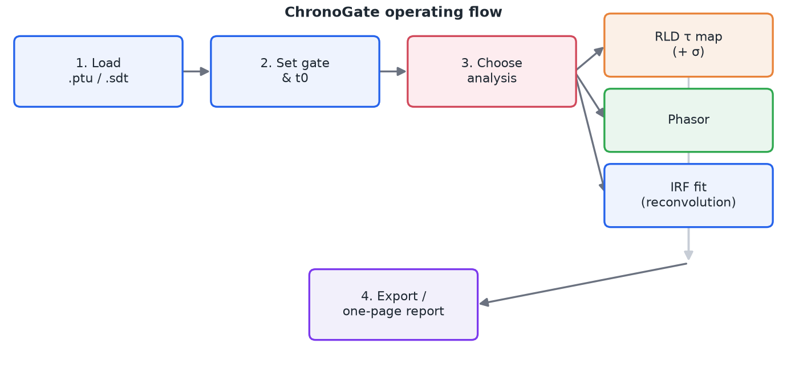
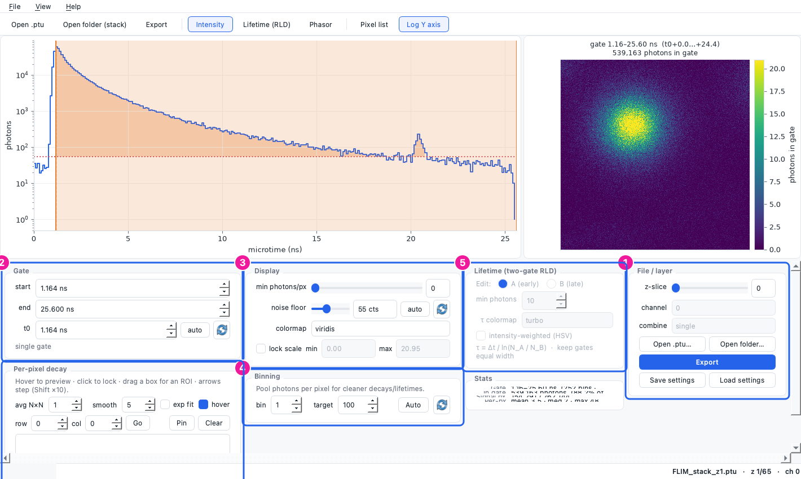
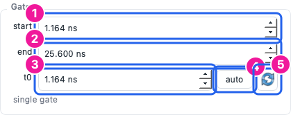
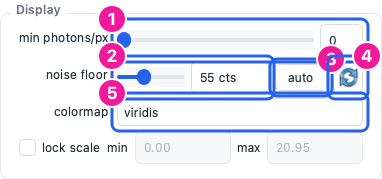
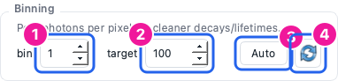
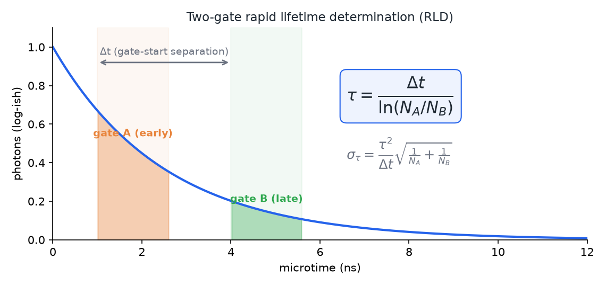
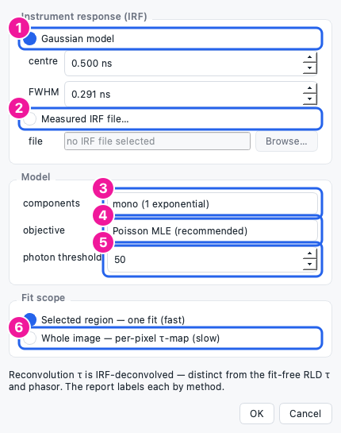
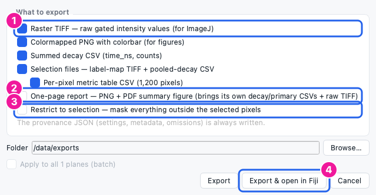

[TOC]

# 1. Purpose & scope

This procedure describes how to operate **ChronoGate**, an interactive
time-gating, rapid-lifetime and phasor viewer for PicoQuant `.ptu` (and Becker &
Hickl `.sdt`) FLIM data. It covers loading data, setting the time gate,
producing lifetime and phasor maps, running a rigorous IRF-reconvolution fit,
and exporting results.

It is a practical operating guide, not a validation report. Absolute-lifetime
work should use a measured IRF (see §10) and be cross-checked against a
reference of known lifetime.

# 2. What ChronoGate does

A pulsed laser excites the sample; for every detected photon the hardware records
the delay since the last pulse (the **microtime**). The per-pixel histogram of
those delays is the **fluorescence decay**. ChronoGate reconstructs that decay
cube and lets you:

- **Time-gate** — keep photons in a chosen microtime window and sum them into an
  image (fit-free lifetime *contrast*).
- **RLD** — read an apparent lifetime from two gates (fit-free, per pixel).
- **Phasor** — plot each pixel's decay as a point on the universal semicircle.
- **IRF fit** — recover a rigorous, IRF-deconvolved lifetime by reconvolution.



**Figure 1.** The end-to-end operating flow: load → gate → choose an analysis →
export.
{: .caption}

# 3. Install & launch

ChronoGate runs from source in a Python **3.12+** environment.

**macOS (double-click launcher).** Keep `ChronoGate.app` and `ChronoGate.command`
together in the project folder and double-click `ChronoGate.app`. The first launch
builds a virtual environment from `pyproject.toml` (a one-time download); later
launches are instant. Changing dependencies triggers an automatic rebuild.

**From a terminal (any OS).**

```
python -m chronogate                 # opens a file picker
python -m chronogate path/to/file.ptu
python -m chronogate path/to/file.sdt
```

> If opening a `.sdt` reports that `sdtfile` is missing, or an IRF fit reports
> `scipy` is missing, your environment predates those dependencies — relaunch so
> the launcher rebuilds it, or run `pip install -e .`.

# 4. Opening data

- **File ▸ Open** (`Ctrl+O`) — choose a `.ptu` or `.sdt` file.
- **File ▸ Open folder (stack)** — load a numbered z-series (e.g.
  `FLIM_stack_z1.ptu … z65.ptu`); step through planes with the **z-slice**
  slider in the File panel.
- **Channel** — for multi-detector files, pick the detector channel.

# 5. The workspace



**Figure 2.** The main window. **1** File/layer (open, z-slice, channel, export,
settings). **2** Gate (start, end, t0). **3** Display (threshold, noise floor,
colormap, scale lock). **4** Binning. **5** Lifetime (RLD) controls. **6**
Per-pixel decay / selection tools. The left plot is the summed decay with the
gate shaded; the right plot is the current image.
{: .caption}

Switch the image with the mode buttons in the toolbar: **Intensity** (`I`),
**Lifetime (RLD)** (`T`), **Phasor** (`P`).

# 6. Setting the gate and t0



**Figure 3.** Gate panel: **1** gate start, **2** gate end (both in ns; you can
also drag the shaded span on the decay plot), **3** t0 (pulse reference), **4**
*auto* (set t0 to the smoothed decay peak), **5** *reset* (set t0 to its default,
0 ns).
{: .caption}

1. Drag the shaded band on the decay plot, or type **start**/**end** in ns.
2. Set **t0** to the pulse arrival: click **auto** for the detected peak, or type
   a value. The **reset** (↻) button returns t0 to 0 ns.
3. The image updates live as you move the gate.

# 7. Display controls



**Figure 4.** Display panel: **1** min photons/px (blank dim pixels), **2** noise
floor (counts, read on the summed decay), **3** floor *auto* (robust baseline),
**4** floor *reset* (0 — no subtraction), **5** colormap.
{: .caption}

- **min photons/px** masks pixels too dim to trust.
- **noise floor** subtracts a flat background so a pedestal doesn't bias the
  lifetime. **auto** picks a robust baseline; **reset** turns subtraction off.
- **lock scale** freezes the colour range so planes/frames are comparable.

# 8. Spatial binning



**Figure 5.** Binning panel: **1** bin factor, **2** target photons/px, **3**
*Auto* (suggest a factor from photon statistics), **4** *reset* (1×, off).
{: .caption}

FLIM pixels are often photon-starved. Binning pools each pixel's neighbourhood
(`b×b`) for cleaner decays and lifetimes. Click **Auto** to reach the target
photon budget, or set the factor by hand. **reset** (↻) returns to 1× (off).

> Binning is the fastest way to make a per-pixel lifetime *map* usable on sparse
> data — see §9 and §10.

# 9. Lifetime & phasor analysis

## 9.1 Two-gate RLD

Press **T** for Lifetime mode. RLD reads an apparent lifetime from two
equal-width gates, per pixel, with no fitting:



**Figure 6.** Two-gate RLD. With equal-width gates separated by Δt, the
width/amplitude factors cancel, giving τ = Δt / ln(N_A/N_B). The shot-noise
uncertainty σ_τ is reported for a pooled region.
{: .caption}

1. In the Lifetime panel choose which gate you are editing (**A** early / **B**
   late) and position the two gates on the decay.
2. Keep the gates **equal width** (the panel warns if not) — RLD assumes it.
3. The τ image appears on the right. Select a region (§11) and open the one-page
   report (§12) to get the pooled **τ ± σ** (shot-noise uncertainty).

## 9.2 Phasor

Press **P**. Each pixel's decay becomes a point `(g, s)`; a single lifetime lands
on the universal semicircle, mixtures fall inside it. Use **Calibrate phasor from
reference…** (View menu) with a dye of known lifetime to remove the instrument/t0
offset, and the **2nd harmonic** toggle to spread short lifetimes apart.

# 10. IRF reconvolution fit (rigorous lifetime)

For an IRF-deconvolved lifetime (rather than fit-free contrast), use **View ▸ IRF
lifetime fit…**.



**Figure 7.** IRF fit dialog: **1** Gaussian IRF model, **2** measured IRF file,
**3** components (mono/bi), **4** objective (Poisson MLE / weighted χ²), **5**
photon threshold, **6** whole-image τ-map (vs. a region fit).
{: .caption}

1. **Choose the IRF.** For a first look, a **Gaussian** model is fine. For
   **absolute** lifetimes, load a **measured IRF** file (a scatter/reflection or
   reference-dye acquisition) — reconvolution is only as good as its IRF.
2. **Model** — mono for one lifetime, bi for two.
3. **Objective** — Poisson MLE (recommended for low counts) or weighted χ².
4. **Scope** — a **region fit** (select a bright ROI first) gives one trustworthy
   τ ± σ; a **whole-image τ-map** fits every pixel above the photon threshold.
5. Read the result: **reduced χ² ≈ 1** means a good fit. A large χ² (e.g. tens or
   hundreds) means the model is wrong — try a measured IRF, or bi-exponential
   (see Troubleshooting). A component reported as **σ = n/a (unidentifiable)** is
   an honest flag that the data cannot separate it.

> For a per-pixel map on sparse data, **bin first** (§8) so pixels clear the
> photon threshold, then run the map. The default threshold adapts to the image.

# 11. Selecting pixels & regions

- **Drag a box** on the image for a rectangular ROI; **lasso** on the phasor plot
  to select a population; or use the **Pixel list** (`View ▸ Pixel list`) to pick
  by metric.
- Hover to preview a pixel's decay; click to lock it; **Pin** to keep several for
  comparison.
- A selection travels with every export and scopes the report's statistics.

# 12. Exporting & the one-page report



**Figure 8.** Export dialog: **1** raster TIFF (raw values, for ImageJ), **2**
one-page report (PNG+PDF with the headline number, decay, image and provenance),
**3** restrict to the current selection, **4** *Export & open in Fiji*.
{: .caption}

- **File ▸ Export** (`Ctrl+E`) — choose artefacts (raw TIFF, colormapped PNG,
  decay CSV, per-pixel table, selection files) and a folder. A content-hashed
  **provenance JSON** is always written.
- **File ▸ Export report** (`Ctrl+R`) — the one-page summary; in Lifetime mode it
  includes the pooled **τ ± σ** for the selection.
- **Restrict to selection** masks everything outside the selected pixels.
- **Export & open in Fiji** writes a raw TIFF plus an ImageJ macro (range, LUT,
  ROI) and launches Fiji on it (set the Fiji path in Preferences first).

# 13. Troubleshooting

| Symptom | Cause | Fix |
|---|---|---|
| τ-map fits **0 px** | photon threshold above every pixel's count | bin more (§8), lower the threshold, or do a region fit |
| IRF fit **reduced χ² ≈ 100s** | wrong/guessed IRF, or model too simple | load a measured IRF; try bi-exponential; check the Gaussian centre/FWHM |
| σ shows **n/a (unidentifiable)** | near-degenerate fit (e.g. two equal τ) | expected/honest — simplify the model or accept the point estimate |
| `.sdt` won't open (`sdtfile` missing) | environment predates the dependency | relaunch (auto-rebuild) or `pip install -e .` |
| RLD τ looks wrong | unequal gates, or no background subtraction | make gates equal width; set the noise floor (§7) |
| app "unidentified developer" warning | installers are unsigned | right-click ▸ Open (macOS) / More info ▸ Run (Windows) |

# 14. Revision history

The SOP is regenerated from the app: edit `docs/sop/sop.md` and
`docs/sop/figures.py`, then run `python docs/sop/build.py`.

| Version | Date | Notes |
|---|---|---|
| {VERSION} | {DATE} | Generated from ChronoGate {VERSION}. |
